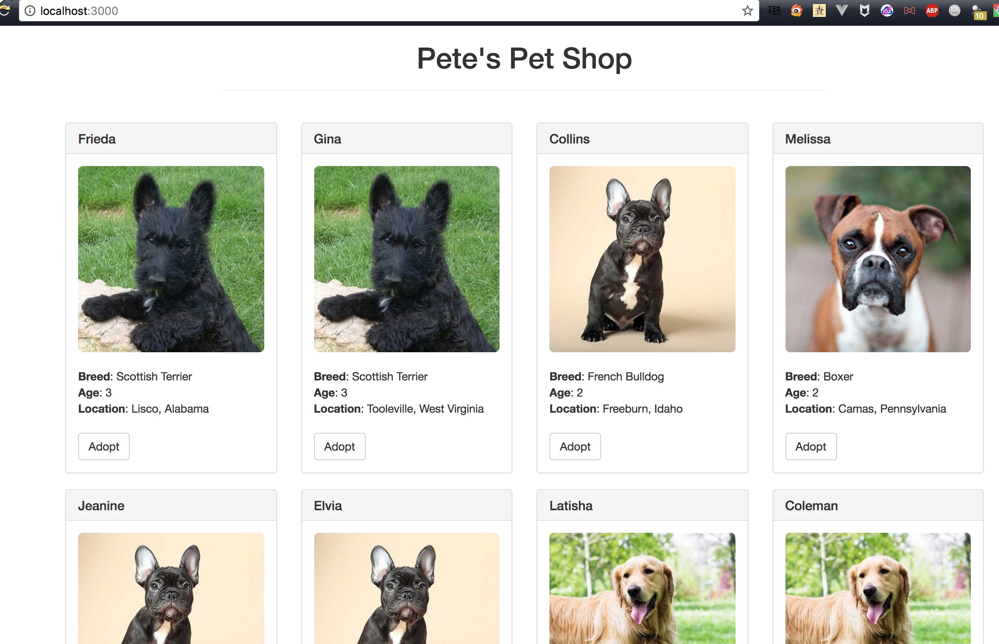

# 基于以太坊的去中心化应用（Dapp）- 宠物商店

http://truffleframework.com/tutorials/pet-shop

https://xiaozhuanlan.com/topic/4875690231

运行截图：

# 知识点
## `Ethereum（以太坊）`
    区块链开发运行平台，对区块链进行了封装，提供了各种开发区块链应用的工具。
##  `智能合约` 
    运行在以太坊上的程序称为智能合约。它是代码和数据（状态）的集合。 
##  `Solidity`
    智能合约的默认编程语言，扩展名以`.sol`结尾。语法类似`Javascript`，但是是像`Java`一样的需要编译成字节码在以太坊虚拟机上运行。
## [browser-solidity](https://ethereum.github.io/browser-solidity) 
    一款基于浏览器的`Solidity`IDE
## `EVM（Ethereum Virtual Machine）`
    以太坊智能合约运行环境。

## 以太坊客户端（钱包）
    可以理解为一个开发者工具，提供了账户管理、挖矿、转账、智能合约的部署和执行等功能。    
    `Geth(go-ethereum)`是常用的开发以太坊使用的客户端，基于`go`语言开发。

## Gas
    和云计算类似，占用区块链的资源（不管是简单的转账交易，还是合约的部署执行），同样需要付出相应的费用。以太坊上用Gas机制来计费，Gas也可以认为是一个工作量单位，智能合约越复杂（计算步骤的数量和类型，占用的内存等），用来完成运行就需要越多Gas。

## testrpc
    一个在本地运行使用内存模拟的以太坊环境，便于调试和开发。目前已经被 [ganache](http://truffleframework.com/ganache/) 取代。

## Dapp
    去中心化的应用（Decentralized App）。

## Truffle 
    Truffle是Dapp开发框架，他可以帮我们处理掉大量无关紧要的小事情，让我们可以迅速开始写代码-编译-部署-测试-打包DApp这个流程。
